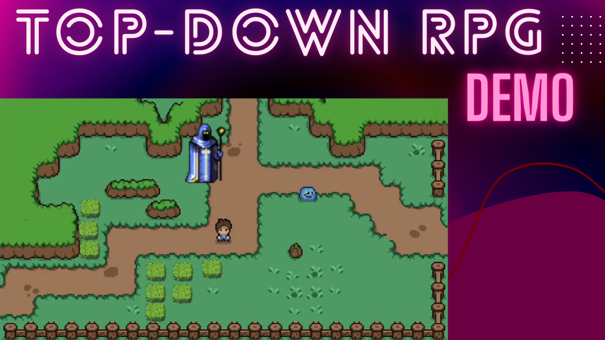

# unity-topdown-rpg-demo

A 2D top-down RPG like Zelda, made in unity.

## Features

### Gameplay Mechanics:
- Free movement on all 4 axes
- Attack activation

### Worldbuilding:
- Scenes designed from tilemaps
- Scene transitions
- Destructible objects
- Movable objects
- Items that can appear randomly

### Lights:
- Shadows cast by objects
- Shadows that move with objects
- Different types of light sources

### Animation:
- Idle
- Walking
- Attack
- Hit
- Dying

### Settings:
- Damage calculation
- Collision detection with objects
- Smooth character transformation

## Tech Stack 🛠️

### Languages 💻

### Frameworks & Platforms ⚙️

### Developer Tools 🧰

## Demo

## Gameplay Demo

